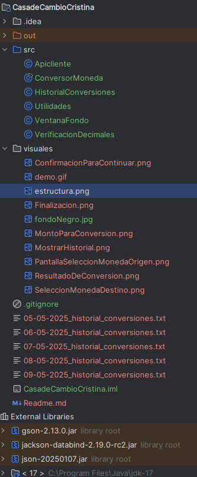

##  🏛️ ESTE PROGRAMA ES EL SEGUNDO CHALLENGE DEL GRUPO G8 Y PRIMERO CORRESPONDIENTE A BACK END - ALURA LATAM
## 🌍 💰 CONVERSOR DE MONEDAS
Este programa permite obtener tasas de conversión en tiempo real
gracias a la integración con ExchangeRate-API
## Descripción
Este conversor de monedas desarrollado en Java, y facilita a
los usuarios obtener tasas de conversión actualizadas mediante la
integración con una API externa; y el almacenamiento en archivos de las conversiones
realizadas.
## Características
    * Operaciones de conversión en tiempo real.
    * Interfaz gráfica mediante JOptionPane.
    * Los montos se visualizan con separadores en miles.
    * Almacenamiento del historial de operaciones de cambio monetario 
      en archivos JSON, con nombres obtenidos de la fecha actual del sistema.
## Tecnologías 
-   Lenguaje : Java

-   Bibliotecas : org.son, java.net, JOptionPane, Gson.

-   API - ExchangeRate : Obtener tipos de cambio

-   Formato de alamcenamiento : JSON.

## Estructura

## Cómo se utiliza?
    - Clonar el repositorio https://github.com/Oscar1900/conversor-de-monedas
    - Ingresar a la carpeta src/
    - Deberá colocar una clave válida de ExchangerRate-API; 
      colocarla en la clase Apicliente.java en: private static final String API_KEY = "colocar clave"
    - Ejecutar el ConversorMoneda.java
     
En caso de no disponer de una clave tendrá que resgistrarse en:
 https://www.exchangerate-api.com/ de manera gratuita.

## Pantallas

## Clases
**ConversorMoneda**: Es el inicio del programa tiene el 
método main(), aqui se ejecuta la lógica principal del conversor de moneda. 
Se definen las estructuras de datos, se realiza la conexión con el 
usuario mediante JOptionPane, se consulta el tipo de cambio y se conecta con
el historial de conversiones.

**VentanaFondo**: Esta clase crea una ventana con fondo personalizado que muestra un 
mensaje de presentación y auspicio. 

**VerificacinDecimales**: Esta clase tiene un método estático que formatea el resultado de la 
conversión y lo muestra al usuario en una ventana emergente y la registra en un historial.

**Apicliente**: Esta clase permite conectarse a la API de ExchangeRate-API para obtener el 
tipo de cambio entre una moneda de origen y una de destino; y devuelve el valor
numérico del cambio solicitado.

**Utilidades**: La clase Utilidades contiene un único método estático llamado 
obtenerCodigoMoneda, y su propósito es extraer el código de una moneda desde un 
texto que lo contiene entre paréntesis.

**HistorialConversiones**: Esta clase tiene dos métodos estaticos:
1. Método mostrarHistorial, el cual formatea y presenta el historial de conversiones;
2. Método guardarHistorial, para archivar las conversiones en archivos TXT y cuyo nombre 
esta prpoporcionado por la fecha en que se realizo la operación. 

## Archivo demo
    

## Dedicatoria
Para Cristina, en cada momento que elabore este programa
siempre estuvo en mi mente y ❤️

## Creado por Oscar Coloma P.
